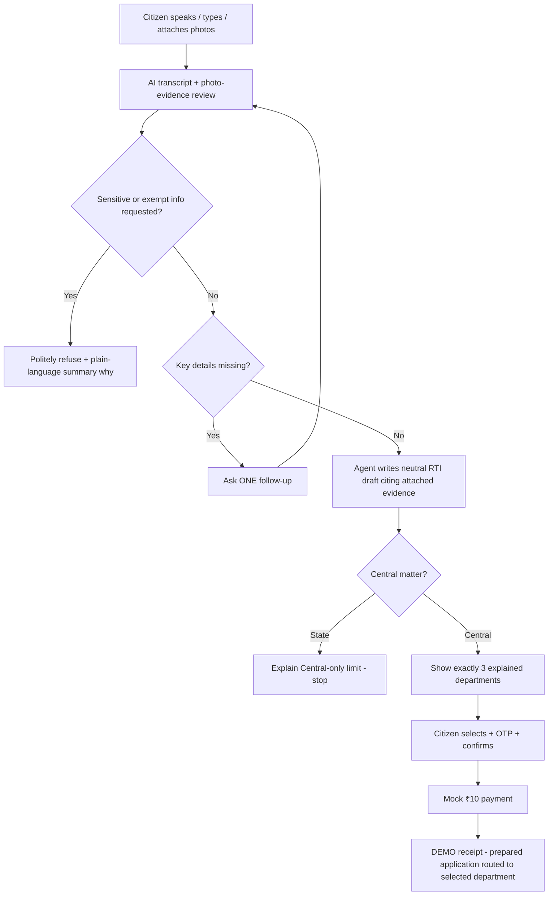
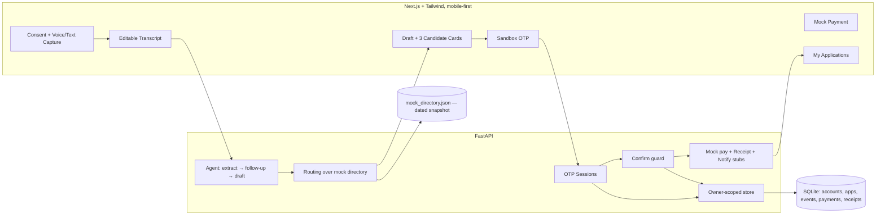

# PRAJA-RTI — HACKATHON PLAN

> **Independent civic-tech hackathon concept.** Not affiliated with the Government of India. No official emblems or wordmarks. Nothing here files, pays, or submits anything to any government system — everything past confirmation is clearly labeled Demo / Simulated / Mock. Implementation has not started yet.

---

## 1. Pitch (30 seconds)

Praja-RTI is a voice-first web app that turns a citizen's spoken complaint — *"the highway near my house has been broken for six months, where did the money go?"* — into a properly worded RTI application for specific records, then recommends the right Central public authority before a clearly simulated ₹10 payment and DEMO receipt.

**Core bet:** most bad RTI outcomes come from two preventable mistakes — filing a *grievance* instead of a *records request*, and picking the *wrong authority* (Section 6(3) transfer, up to 5 days lost). An agent that drafts neutrally and explains its routing recommendation fixes both.

---

## 2. Problem worth solving

| Pain point | Impact |
| :--- | :--- |
| Jargon & literacy barrier | Citizens struggle to frame requests as legally valid record demands. |
| Grievance vs. RTI confusion | Complaint-style asks ("fix the road") get rejected; RTI only covers material records. |
| Wrong-authority transfers | Section 6(3): wrong department = transfer within up to 5 days, plus handling delay. |
| State filed on Central portal | rtionline.gov.in is Central-only; State matters are rejected (fee lost, 30 days wasted). |
| No voice / vernacular support | Zero accessibility for regional-language speakers uncomfortable typing formal English/Hindi. |

Official-portal facts worth citing in the pitch (verified Aug 2026):
- Portal lists **2,916 public authorities** (Central only).
- Request text limited to **3,000 characters**; longer needs a PDF attachment.
- Fee: **₹10**, waived for BPL applicants with certificate. First appeal: **no fee**.
- Response window: **30 days** (48 hours for life-and-liberty matters).
- Status lookup requires registration number + email + CAPTCHA/OTP.

---

## 3. Core demo flow



1. Citizen speaks naturally (voice primary, full text fallback) and may attach photos of the incident. Visible editable transcript; interruptible anytime.
2. Agent extracts only the essentials: records sought, date range, location, likely body, format — plus observable facts from any uploaded photos. Asks **one** plain follow-up when something material is missing. Accepts "I don't know." Never invents facts.
3. **Sensitive-request guard:** if the ask targets exempt material — national security, cabinet papers, trade secrets, personal details of officials unconnected to public duty (Section 8(1)) — the agent does **not** draft. It refuses plainly and returns a short summary of exactly why (which exemption applies), with a lawful reframing where one exists.
4. Agent separates grievance language from the information need, writes the complete neutral editable RTI draft (citing attached evidence where relevant), reads it back. Citizen corrects by voice or text.
5. Jurisdiction gate: **State matter → explain Central-only limit, stop cleanly** (no fabricated State authorities). Central matter → return **exactly 3 explained candidates** with reasons + ambiguity warnings. Citizen can select, manually search, or override.
6. Sandbox OTP sign-in (or fixed judge OTP when offline) before confirmation — never silently.
7. Explicit confirm of draft **and** destination → mock ₹10 payment (BPL ₹0 path) → idempotent `DEMO` receipt (`government_submission_status: NOT_SUBMITTED`).
8. Sandbox test email/SMS with consent; deterministic outbox preview fallback. On-screen/download receipt always available.
9. **My Applications**: owner-scoped history with internal-only timeline (Draft → Authority selected → Prepared → Receipt generated → …). Every screen says it is demo history, not synchronized with RTI Online.

---

## 4. Scope

**In (hackathon):**
Voice/text/photo intake → agent-authored editable draft → exactly 3 explained Central candidates → sandbox OTP → explicit confirm → mock payment → simulated receipt → sandbox notifications w/ fallback → authenticated internal history — plus a sensitive/exemption guard that refuses with a reasoned summary, and vision-based photo-evidence analysis folded into the draft.

**Out (deferred, mention only as future work):**
Real government integration or filing · real payments · live SLA tracking/reminders/deemed refusal · appeal generation (Sections 18/19/20 are context only) · production identity verification & account recovery · production email/SMS delivery.

---

## 5. Mock data strategy

Everything runs off local mock data. No external service is required for the demo to work.

### 5.1 Do we need to scrape all 2,916 authorities? — No.

Verified: the official page (`rtionline.gov.in/request/allpa.php`) really lists 2,916 public authorities. But:

- The list is dominated by tiny subordinate offices — hundreds of ICAR research institutes, dozens of CAG audit field offices, etc. Almost none will ever be matched in a demo.
- A hackathon demo exercises **fewer than 10 authorities end-to-end**. Judges evaluate approach and explanation quality, not directory completeness.
- Scraping 2,916 rows adds parsing fragility, staleness risk, and cleanup work with zero demo value.

**Decision:** ship a **curated mock directory of ~40–60 well-known Central public authorities** as JSON/SQLite, each with: `pa_code`, official display name, parent ministry, topic keywords, jurisdiction type.

Suggested seed set: NHAI, MoRTH, Railway Board/IRCTC, MEA (Passports/CPV), CBDT (Income Tax), CBIC/GST, EPFO, ESIC, SBI & nationalized banks, RBI, SEBI, CBSE, NTA, UGC, AICTE, UIDAI, AIIMS, ICMR, Delhi Police, DRDO, ISRO, HAL, BHEL, NTPC, ONGC, Coal India, TRAI, BSNL, DoPT, Election Commission, CIC, NHRC, Ministry of Minority Affairs, Department of Revenue, FSSAI, Bureau of Indian Standards… plus a handful from the demo scripts you'll actually perform.

Labeling requirements:
- Directory metadata carries `snapshot_date` and `"mock snapshot, not official"` — shown in UI and returned in API responses.
- Manual search searches this same mock set. Overrides outside the set require an acknowledgment that the destination could not be verified.

*Optional stretch (only if ahead of schedule):* one-time scripted fetch of the official listing to expand coverage. Still stored locally, dated, and labeled mock. Never presented as live. Not on the critical path.

### 5.2 Deterministic no-key mode (must have)

The reliable judging path works with zero credentials/API keys:
- Sample audio per language → fixed labeled transcript fixture.
- Sample photo + prompt → fixed labeled evidence-analysis fixture.
- Rule-based conversation fixture asks the expected missing-detail question.
- Template drafting builds the full application from confirmed facts.
- Keyword/BM25 lookup over the mock directory returns the 3 candidates.
- Mock payment/receipts deterministic; notifications write redacted previews (`FALLBACK_ONLY`).
- OTP uses a judge-only code, visibly labeled, still exercising expiry/attempt limits.

Every adapter reports its mode: `LIVE_SANDBOX` | `DETERMINISTIC_DEMO` | `UNAVAILABLE`.

### 5.3 Photo / evidence uploads

- Intake accepts up to 3 images (JPG/PNG, ≤5 MB each) alongside voice/text.
- A vision pass extracts **only what is clearly observable**: scene description, visible text/signboards, apparent damage or condition, timestamps if present. Findings are read back and become draft facts **only after citizen confirmation** — the AI never asserts what a photo proves.
- The draft references photos as attached supporting evidence ("photographs of the incident attached"), matching the official portal's attachment-based filing format; it never uses them as accusations.
- Without a vision key, a deterministic labeled fixture simulates the analysis (`Demo evidence analysis` badge).
- Privacy: images are deleted after processing unless the citizen saves the application; then retained only inside that owned demo record and removed with it.

---

## 6. Architecture



| Component | Responsibility | Boundary |
| :--- | :--- | :--- |
| Browser shell | Mobile-first flow, permanent independent-demo notice, language/theme/text-size controls | No provider secrets; no gov styling |
| Intake | Consent, audio/text capture, transcript edit | Audio deleted after transcription |
| Agent | Missing-detail follow-ups, understanding summary, full draft authoring, read-back | Never invents facts/dates/bodies |
| Routing | Exactly 3 explained candidates on successful Central match; State redirect otherwise | Match labels, never confidence percentages |
| Confirm guard | Blocks mock payment until draft+destination explicitly confirmed server-side | Session-owned, not client-supplied IDs |
| Mock payment/receipt | Idempotent deterministic results, `DEMO` references | No real money/gateway |
| History | Owner-scoped list/detail/timeline/receipt/retry/delete | Generic 404 for non-owned records |

---

## 7. API surface

All endpoints: TLS, rate limits, ownership derived from session cookie only (never client-supplied user ID), generic errors, idempotency keys on mutations that create state.

| Endpoint | Contract |
| :--- | :--- |
| `POST /auth/otp/request` | E.164 mobile → generic ack, 5-min expiry, 45-s resend cooldown |
| `POST /auth/otp/verify` | ≤5 attempts, consume-once, rotate session, HttpOnly Secure cookie |
| `GET /auth/me`, `POST /auth/logout` | Current session info; revoke |
| `POST /agent/intake-and-draft` | Audio, edited transcript, optional evidence photos → transcript, confirmed facts + evidence findings (citizen-confirmed), summary, full editable draft — or one follow-up question — or `outcome: REJECTED_EXEMPT` with `rejection_summary` |
| `POST /routing/recommend` | Normalized need → exactly 3 ranked candidates (stable ID, name, ministry, reason, context, ambiguity warning) + snapshot metadata; State matter → redirect state |
| `GET /public-authorities/search?q=` | Search the mock directory |
| `POST /demo/confirm` | Authenticated; binds app to owner; returns confirmation token |
| `POST /demo/mock-payments` | Idempotency-Key required; `SIMULATED_SUCCESS/FAILED`; `real_money_charged: false` |
| `POST /demo/receipts` | One idempotent `DEMO-*` reference, `NOT_SUBMITTED`, download link |
| `POST /demo/receipts/{ref}/notifications` | Per-channel idempotent sandbox email/SMS; `FALLBACK_ONLY` when unavailable |
| `GET /applications` (+`/{ref}`, `/events`, `/receipt`) | Owner-scoped list, detail, timeline, private receipt |
| `POST /applications/{ref}/notifications/{ch}/retry` | Retry failed channel only |
| `DELETE /applications/{ref}` | Hide immediately + purge queued; idempotent |

Internal status vocabulary (never implies government action): `DRAFT, NEEDS_INFORMATION, AWAITING_CITIZEN_CONFIRMATION, AUTHORITY_SELECTED, MOCK_PAYMENT_PENDING, PREPARED, SIMULATED_SUBMISSION_COMPLETE, RECEIPT_GENERATED, NOTIFICATION_SENT, NOTIFICATION_FAILED, DELETED`.

---

## 8. Data model (minimal)

```
users(id, mobile_lookup_hash UNIQUE, created_at)
otp_challenges(id, mobile_hash, otp_digest, expires_at, attempts, consumed_at)   -- plaintext OTP never stored
applications(id PK, owner_id FK, pa_code FK, language, draft_text, draft_version,
             selection_source, confirmed_draft BOOL, confirmed_authority BOOL,
             status ENUM, created_at, deleted_at)
status_events(id, application_id FK, seq, event_type, actor, occurred_at,
              UNIQUE(application_id, seq))                                       -- append-only
payments(id, application_id FK, amount INR, mode, status, idempotency_key UNIQUE)
receipts(demo_reference PK, application_id FK UNIQUE, payload JSON, idempotency_key UNIQUE)
public_authorities(pa_code PK, display_name, ministry, keywords[], snapshot_date)
```

Hackathon storage: SQLite file. Postgres/pgvector is a production migration path, not needed for the demo.

---

## 9. Agent drafting rules (the LLM prompt core)

1. RTI covers **existing material records** (files, certified copies, budgets, tenders, registers, logbooks, file notings) — not grievance redressal.
2. Strip emotional/accusatory language from the draft; keep the citizen's raw words only in the transcript.
3. Convert "why" complaints into requests for rules, written reasons recorded on file, inspection registers.
4. Produce 3–5 numbered, specific record requests.
5. The agent writes the complete application — the citizen never supplies legal wording.
6. Never invent dates, locations, identities, bodies, or record types. Ask instead, or state the limitation in the draft.
7. Call it an "application"/"request", never a complaint. Optional: tag life-and-liberty matters `PRIORITY_48H` (Sec 7(1) proviso).
8. Exemption guard: requests aimed at exempt material — national security, cabinet papers, trade secrets, personal details of officials unconnected to public duty (Sec 8(1)) — are **never drafted**. Reply with a short plain-language summary of which exemption applies and why; suggest a lawful reframing where one exists.
9. Evidence rule: derive facts only from what is clearly visible in uploaded photos; confirm each finding with the citizen before it enters the draft; reference photos as attached supporting evidence, never as proof of accusations.

Worked example (use in demo/pitch):

> **Raw grievance:** "The road outside my house in Sector 4 is broken for months. Why is the government not fixing it? Officers are corrupt!"
>
> **Agent-authored draft:** "Please provide certified copies of: (1) the work order, sanctioned budget, and contractor details for Road #12, Sector 4; (2) the scheduled completion date and delay-penalty clauses; (3) quality inspection reports submitted by the site engineer."

---

## 10. UI & accessibility essentials

- Mobile-first, one primary decision per screen. Voice control is the home-screen primary action; equal "Use text instead" fallback.
- Permanent localized banner: *"Independent Praja-RTI hackathon demo — not affiliated with the Government of India; no RTI application is filed here."* No emblem, seal, or `gov.in` look-alike styling.
- Theme Light/Dark/System; A−/A/A+ text sizing; reduced-motion respected; keyboard accessible; ≥44 px tap targets; ≥4.5:1 contrast; icons always paired with labels; screen-reader announcements for transcript/recording/status changes.
- Simulation badges at point of use: `Demo transcription`, `Recommended authority`, `Mock payment`, `Simulated receipt`, `Fallback only`.
- Tokens: indigo `#243B6B` primary, coral `#C24E3D` recording accent, teal `#176B67` confirmed states, danger `#B42318`.
- Confirmation requires explicit affirmative action on both draft and destination — silence, navigation, or OTP success is not confirmation.

---

## 11. Three-minute demo script

```
[0:00–0:30] PROBLEM — Screenshot of rtionline.gov.in: 2,916 authorities, English forms,
            no voice. Wrong pick = Sec 6(3) transfer (up to 5 days).

[0:30–1:20] VOICE AGENT — Open on phone. Toggle Dark mode, tap A+, switch to Hindi.
            Speak the NH-27 pothole rant. Show: labeled simulated transcript, one
            smart follow-up (missing date range), understanding summary, complete
            editable draft read back in Hindi. Citizen corrects one word by voice.

[1:20–2:05] ROUTING — Exactly 3 candidate cards (NHAI strong match; MoRTH possible;
            NHIDCL alternative), each with reason + ambiguity warning, no fake
            confidence %. Judge OTP sign-in (labeled demo credential). Citizen
            selects NHAI and explicitly confirms draft + destination.

[2:05–2:30] MOCK PAYMENT — Simulate ₹10 (mention BPL ₹0 path). Idempotent DEMO
            receipt: "INDEPENDENT DEMO — NOT FILED WITH GOVERNMENT".

[2:50–3:00] IMPACT — My Applications timeline: authority selected → prepared →
            receipt generated. Banner: "not synchronized with any government system."
            Close: "This explores how a voice agent can reduce misrouted and
            rejected RTIs — prepared with the citizen, confirmed by the citizen."
```

(Squeeze sandbox email/SMS with one `FALLBACK_ONLY` channel into 2:30–2:50 to prove honest failure handling.)

(Optional judge-bait beat: type a sensitive ask — *"give me the minister's personal bank details"* — and show the polite refusal with its reason summary instead of a draft.)

---

## 12. Build order

1. Contracts + curated mock directory (~40–60 PAs, dated JSON).
2. Accessible mobile shell: banner, theme/text-size/language controls.
3. Intake: mic capture, transcript edit, deterministic STT fixture.
4. Agent loop + guardrails: follow-up question, fact confirmation, sensitive/exemption rejection with reasoned summary, evidence-photo vision pass, full draft, read-back.
5. Routing: keyword/BM25 over mock directory → 3 explained candidates; State redirect; manual search + override.
6. OTP sessions + judge mode.
7. Confirm guard + mock payment + simulated receipt.
8. My Applications: owner-scoped list/timeline/private receipt/deletion.
9. Sandbox email/SMS + deterministic fallback.
10. Hardening pass + rehearse the 3-minute script twice.

---

## 13. Must-pass checks

| Check | Expected |
| :--- | :--- |
| Draft quality | Complete editable application from voice facts; zero invented facts |
| Sensitive ask | Exemption-targeting request returns a reasoned refusal and no draft |
| Evidence photos | Observable findings extracted from image, citizen-confirmed before entering the draft |
| Routing | Exactly 3 explained candidates on valid Central match; State matter redirects without fabricating destinations |
| Honest vocabulary | Only approved internal statuses; nothing says filed/accepted/replied |
| Idempotency | Repeat pay/receipt/notify calls return the original result, no duplicates |
| Ownership | Guessing another user's reference → generic 404; owner always from session |
| No-key path | Full demo works offline with deterministic adapters |
| OTP hygiene | Expiry/cooldown/attempts enforced server-side; generic errors |
| Deletion | Record hides immediately, purge follows, repeat delete is idempotent |
| A11y basics | Keyboard flow, contrast, tap targets, reduced motion pass spot-check |

---

## 14. Legal quick reference (context only — no compliance claim)

| Section | Fact | Use in product |
| :--- | :--- | :--- |
| 6(1) | Request in writing/electronic means, English/Hindi/official language | Voice + multilingual framing is legitimate |
| 6(2) | No reason required for asking | Agent never asks motivations |
| 6(3) | Misrouted applications transferred within 5 days | The routing-recommendation motivation |
| 7(1) | 30-day response (48 h life/liberty) | Pitch context only |
| 7(5) | ₹10 fee; BPL exempt with certificate | Mock fee + BPL toggle |
| 19(1) | First appeal within 30 days, no fee | Mention as deferred future feature |

---

## 15. Local development

Simplest stack — skip Docker unless the team prefers it:

```bash
server:  uvicorn main:app --reload        # FastAPI + SQLite, PRAJA_DEMO_MODE=deterministic
web:     npm run dev                       # Next.js, NEXT_PUBLIC_API_URL=http://localhost:8000
data:    python scripts/build_directory.py # generates mock_directory.json from seed list
```

No secrets required for the demo path. Sandbox providers (OTP/email/SMS) are opt-in via env vars; absent keys automatically select the labeled deterministic adapters.
